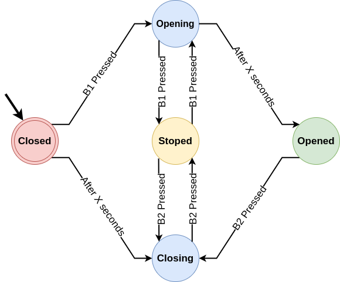

# Garage-Door-Remote_STM32F103C8
Garage door remote based on finite state machine by function pointer for STM32F103C8.

**Note:** _Under development - For study purposes_
## Resources explored
* FreeRTOS V202011.00
  * Software Timer
  * Queues
* External interrupt
* Function pointer
* Finite State Machine

## How it works
* Two input buttons **B1** (Button to open), **B2** (Button to close). 
* **After X seconds**, where **X** is the time in seconds to open/close the garage door completely.

